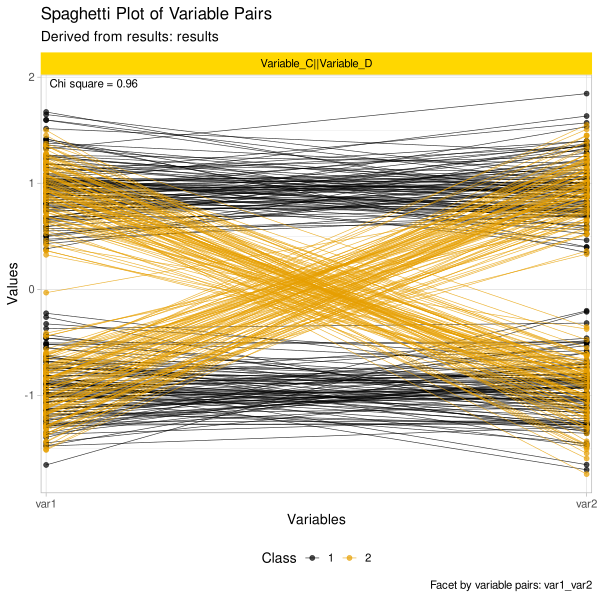
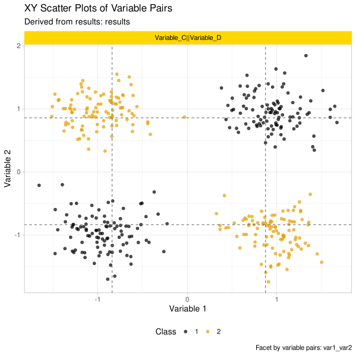

# detectXOR: XOR pattern detection and visualization in R

Provides tools for detecting XOR-like patterns in variable pairs. Includes visualizations for pattern exploration.

## Overview

Traditional feature selection methods often miss complex non-linear relationships where variables interact to produce class differences. The `detectXOR` package specifically targets **XOR patterns** - relationships where class discrimination only emerges through variable interactions, not individual variables alone.

### Key capabilities

🔍 **XOR pattern detection** - Statistical identification using χ² and Wilcoxon tests  
📈 **Correlation analysis** - Class-wise Kendall τ coefficients  
📊 **Visualization** - Spaghetti plots and decision boundary visualizations  
⚡ **Parallel processing** - Multi-core acceleration for large datasets  
🔬 **Robust statistics** - Winsorization and scaling options for outlier handling  

## Installation

Install the development version from GitHub:
```r
# Install devtools if needed
if (!requireNamespace("devtools", quietly = TRUE)) { install.packages("devtools") }
# Install detectXOR
devtools::install_github("JornLotsch/detectXOR")
```
```
### Dependencies
The package requires R ≥ 3.5.0 and depends on:
- `dplyr`, `tibble` (data manipulation)
- `ggplot2`, `ggh4x`, `scales` (visualization)
- `future`, `future.apply`, `pbmcapply`, `parallel` (parallel processing)
- `reshape2`, `glue` (data processing and string manipulation)
- `DescTools` (statistical tools)
- Base R packages: `stats`, `utils`, `methods`, `grDevices`

Optional packages (suggested):
- `testthat`, `knitr`, `rmarkdown` (development and documentation)
- `doParallel`, `foreach` (additional parallel processing options)

## Quick start
### Basic XOR detection
``` r
library(detectXOR)
# Load example data
data(XOR_data)
# Detect XOR patterns with default settings
results <- detectXOR(XOR_data, class_col = "class")
# View summary
print(results$results_df)
```
### Usage with custom parameters
``` r
# Detection with custom thresholds and parallel processing
results <- detectXOR(
  data = XOR_data,
  class_col = "class",
  p_threshold = 0.01,
  tau_threshold = 0.4,
  max_cores = 4,
  extreme_handling = "winsorize",
  scale_data = TRUE
)
```
### Visualization
``` r
# Generate publication-ready plots
generate_spaghetti_plot_from_results(results, XOR_data) 
generate_xy_plot_from_results(results, XOR_data)
```

### Example plots 






## Function parameters
### `detectXOR()` - Main detection function

| Parameter | Type | Default | Description |
| --- | --- | --- | --- |
| `data` | data.frame | _required_ | Input dataset with variables and class column |
| `class_col` | character | `"class"` | Name of the class/target variable column |
| `check_tau` | logical | `TRUE` | Compute class-wise Kendall τ correlations |
| `compute_axes_parallel_significance` | logical | `TRUE` | Perform group-wise Wilcoxon tests |
| `p_threshold` | numeric | `0.05` | Significance threshold for statistical tests |
| `tau_threshold` | numeric | `0.3` | Minimum absolute τ for "strong" correlation |
| `abs_diff_threshold` | numeric | `20` | Minimum absolute difference for practical significance |
| `split_method` | character | `"quantile"` | Tile splitting method: `"quantile"` or `"range"` |
| `max_cores` | integer | `NULL` | Maximum cores for parallel processing (auto-detect if NULL) |
| `extreme_handling` | character | `"winsorize"` | Outlier handling: `"winsorize"`, `"remove"`, or `"none"` |
| `winsor_limits` | numeric vector | `c(0.05, 0.95)` | Winsorization percentiles |
| `scale_data` | logical | `TRUE` | Standardize variables before analysis |
| `use_complete` | logical | `TRUE` | Use only complete cases (remove NA values) |
### Visualization functions

| Function | Description | Key Parameters |
| --- | --- | --- |
| `generate_spaghetti_plot_from_results()` | Creates connected line plots showing variable trajectories for XOR-detected pairs | `results`, `data`, `class_col`, `output_dir = "."`, `scale_data = TRUE` |
| `generate_xy_plot_from_results()` | Generates scatter plots with decision boundary lines for detected XOR patterns | `results`, `data`, `class_col`, `output_dir = "."`, `quantile_lines = c(1/3, 2/3)`, `line_method = "quantile"` |
Both functions return ggplot objects and automatically save SVG files to the specified output directory.
## Output structure
The `detectXOR()` function returns a list with two components:
### `results_df` - Summary data frame

| Column | Description |
| --- | --- |
| `var1`, `var2` | Variable pair names |
| `xor_shape_detected` | Logical: XOR pattern identified |
| `chi_square_p` | χ² test p-value for tile independence |
| `practical_significance` | Logical: meets practical significance threshold |
| `tau_class_0`, `tau_class_1` | Class-wise Kendall τ coefficients |
| `tau_difference` | Absolute difference between class τ values |
| `wilcox_p_x`, `wilcox_p_y` | Wilcoxon test p-values for each axis |
| `significant_wilcox` | Logical: significant group differences detected |
### `pair_list` - Detailed results
Contains comprehensive analysis for each variable pair including:
- Tile pattern analysis results
- Statistical test outputs
- Processed data subsets
- Intermediate calculations

## Methodology
### XOR detection pipeline
1. **Pairwise dataset creation** - Extract all variable pairs with preprocessing
2. **Tile pattern analysis** - Divide variable space into 2×2 tiles and test for XOR-like distributions
3. **Statistical validation** - Apply χ² tests for independence and Wilcoxon tests for group differences
4. **Correlation analysis** - Compute class-wise Kendall τ to quantify relationship strength
5. **Result aggregation** - Combine findings into interpretable summary format

### Statistical tests
- **χ² Test**: Tests independence of tile patterns vs. random distribution
- **Wilcoxon rank sum**: Evaluates group differences along variable axes
- **Kendall τ**: Measures monotonic correlation within each class separately

## Use cases
### Machine learning
- **Feature selection enhancement** - Identify interaction features that complement traditional univariate methods
- **Variable interaction discovery** - Find synergistic variable pairs where class separation emerges only through combined effects
- **Preprocessing for ensemble methods** - Generate interaction features for boosting algorithms and neural networks
- **Dimensionality reduction guidance** - Preserve important variable interactions when reducing feature space

## Technical details
### Cross-platform compatibility
- **Windows**: Uses `future::multisession` for parallel processing
- **Unix/Linux/macOS**: Uses `pbmcapply::pbmclapply` with fork-based parallelism
- **Memory management**: Automatic chunk-based processing for large datasets

### Package structure
``` 
detectXOR/
├── R/                  # Source code
├── man/               # Documentation
├── tests/             # Unit tests (testthat)
├── vignettes/         # Long-form documentation
├── data/              # Example datasets
└── inst/              # Additional resources
```
## Contributing
Contributions are welcome! Please feel free to submit issues, feature requests, or pull requests on GitHub.
## License
GPL-3
## Citation
```
For citation details or to request a formal publication reference, please contact the maintainer.
